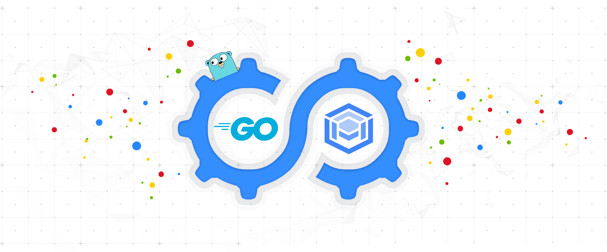

<p align="center">
    <a href="https://cloud.google.com/alloydb/docs/connect-language-connectors#go-pgx">
        
    </a>
</p>

# AlloyDB Go Connector

[![CI][ci-badge]][ci-build]
[![Go Reference][pkg-badge]][pkg-docs]

[ci-badge]: https://github.com/GoogleCloudPlatform/alloydb-go-connector/actions/workflows/tests.yaml/badge.svg?event=push
[ci-build]: https://github.com/GoogleCloudPlatform/alloydb-go-connector/actions/workflows/tests.yaml?query=event%3Apush+branch%3Amain
[pkg-badge]: https://pkg.go.dev/badge/cloud.google.com/go/alloydbconn.svg
[pkg-docs]: https://pkg.go.dev/cloud.google.com/go/alloydbconn

The AlloyDB Go Connector is the recommended way to connect to AlloyDB from Go
applications. It provides:

- **Secure connections** — TLS 1.3 encryption and identity verification,
  independent of the database protocol
- **IAM-based authorization** — controls who can connect to your AlloyDB
  instances using Google Cloud IAM
- **No certificate management** — no SSL certificates, firewall rules, or IP
  allowlisting required
- **IAM database authentication** — optional support for
  [automatic IAM DB authentication][iam-db-authn]

[iam-db-authn]: https://cloud.google.com/alloydb/docs/manage-iam-authn

## Quick Start

Install the module:

```sh
go get cloud.google.com/go/alloydbconn
```

Connect using the standard `database/sql` package:

```go
package main

import (
    "database/sql"
    "fmt"
    "log"

    "cloud.google.com/go/alloydbconn/driver/pgxv5"
)

func main() {
    // Register the AlloyDB driver with the name "alloydb"
    // Uses Private IP by default. See Network Options below for details.
    cleanup, err := pgxv5.RegisterDriver("alloydb")
    if err != nil {
        log.Fatal(err)
    }
    defer cleanup()

    // Instance URI format:
    //   projects/PROJECT/locations/REGION/clusters/CLUSTER/instances/INSTANCE
    db, err := sql.Open("alloydb", fmt.Sprintf(
        "host=%s user=%s password=%s dbname=%s sslmode=disable",
        "projects/my-project/locations/us-central1/clusters/my-cluster/instances/my-instance",
        "my-user",
        "my-password",
        "my-db",
    ))
    if err != nil {
        log.Fatal(err)
    }
    defer db.Close()

    var greeting string
    if err := db.QueryRow("SELECT 'Hello, AlloyDB!'").Scan(&greeting); err != nil {
        log.Fatal(err)
    }
    fmt.Println(greeting)
}
```

The connector uses [Application Default Credentials (ADC)][adc] automatically.
For local development, run:

```sh
gcloud auth application-default login
```

[adc]: https://cloud.google.com/docs/authentication#adc

## Table of Contents

- [Prerequisites](#prerequisites)
- [Connecting with database/sql](#connecting-with-databasesql)
- [Connecting with pgx](#connecting-with-pgx)
- [Network Options](#network-options)
  - [Private IP (default)](#private-ip-default)
  - [Public IP](#public-ip)
  - [Private Service Connect (PSC)](#private-service-connect-psc)
- [IAM Database Authentication](#iam-database-authentication)
- [Configuring the Dialer](#configuring-the-dialer)
- [Observability](#observability)
- [Debug Logging](#debug-logging)
- [Support Policy](#support-policy)

## Prerequisites

### IAM Permissions

The IAM principal (user or service account) making connections needs:

- [AlloyDB Client][client-role] role (`roles/alloydb.client`)
- Service Usage Consumer role (`roles/serviceusage.serviceUsageConsumer`)

[client-role]: https://cloud.google.com/alloydb/docs/auth-proxy/overview#how-authorized

### Enable the AlloyDB API

Enable the [AlloyDB API][admin-api] in your Google Cloud project.

[admin-api]: https://console.cloud.google.com/apis/api/alloydb.googleapis.com

### Credentials

The connector uses [Application Default Credentials (ADC)][adc] — **this is
the recommended approach for most applications.** ADC automatically finds
credentials from the environment:

- **Local development:** run `gcloud auth application-default login` once
- **Google Cloud (Compute Engine, Cloud Run, GKE, etc.):** credentials are
  picked up automatically from the attached service account — no code changes
  needed

```sh
# One-time setup for local development
gcloud auth application-default login
```

If you need to supply credentials explicitly (e.g., in non-Google managed
environments without Application Default Credentials), see the [Configuring the
Dialer](#configuring-the-dialer) section for less common alternatives.

[set-adc]: https://cloud.google.com/docs/authentication/provide-credentials-adc

## Connecting with database/sql

The `database/sql` approach works with any library that accepts a `*sql.DB`.

```go
import (
    "database/sql"
    "fmt"

    "cloud.google.com/go/alloydbconn"
    "cloud.google.com/go/alloydbconn/driver/pgxv5"
)

func connect(instURI, user, pass, dbname string) (*sql.DB, func() error, error) {
    // RegisterDriver registers the AlloyDB driver and returns a cleanup
    // function that stops background goroutines. Call cleanup when you are
    // done with the database connection to avoid a goroutine leak.
    cleanup, err := pgxv5.RegisterDriver("alloydb")
    if err != nil {
        return nil, nil, err
    }

    db, err := sql.Open("alloydb", fmt.Sprintf(
        // sslmode=disable is correct here: the connector handles TLS.
        "host=%s user=%s password=%s dbname=%s sslmode=disable",
        instURI, user, pass, dbname,
    ))
    if err != nil {
        return nil, cleanup, err
    }
    return db, cleanup, nil
}
```

> **Instance URI format:**
> `projects/PROJECT/locations/REGION/clusters/CLUSTER/instances/INSTANCE`

## Connecting with pgx

For direct control over connection pooling, use [pgx](https://github.com/jackc/pgx)
with `pgxpool`:

```go
import (
    "context"
    "fmt"
    "net"

    "cloud.google.com/go/alloydbconn"
    "github.com/jackc/pgx/v5/pgxpool"
)

func connect(ctx context.Context, instURI, user, pass, dbname string) (*pgxpool.Pool, func() error, error) {
    d, err := alloydbconn.NewDialer(ctx)
    if err != nil {
        return nil, func() error { return nil }, fmt.Errorf("failed to init dialer: %v", err)
    }
    // cleanup stops the dialer's background goroutines.
    cleanup := func() error { return d.Close() }

    config, err := pgxpool.ParseConfig(fmt.Sprintf(
        "user=%s password=%s dbname=%s sslmode=disable",
        user, pass, dbname,
    ))
    if err != nil {
        return nil, cleanup, fmt.Errorf("failed to parse config: %v", err)
    }

    // Tell pgx to use the AlloyDB connector for all connections.
    config.ConnConfig.DialFunc = func(ctx context.Context, _, _ string) (net.Conn, error) {
        return d.Dial(ctx, instURI)
    }

    pool, err := pgxpool.NewWithConfig(ctx, config)
    if err != nil {
        return nil, cleanup, fmt.Errorf("failed to connect: %v", err)
    }
    return pool, cleanup, nil
}
```

## Network Options

AlloyDB supports three connectivity modes. The connector defaults to
**private IP**.

### Private IP (default)

Private IP requires your application to run within a [VPC Network][vpc]
connected to your AlloyDB instance. No extra configuration is needed — the
default `d.Dial(ctx, instURI)` call will connect over private IP.

[vpc]: https://cloud.google.com/vpc/docs/vpc
[alloydb-connectivity]: https://cloud.google.com/alloydb/docs/configure-connectivity

### Public IP

Pass `WithPublicIP()` to connect over the instance's public IP address.

**With database/sql:**

```go
cleanup, err := pgxv5.RegisterDriver("alloydb",
    alloydbconn.WithDefaultDialOptions(alloydbconn.WithPublicIP()),
)
```

**With pgx:**

```go
config.ConnConfig.DialFunc = func(ctx context.Context, _, _ string) (net.Conn, error) {
    return d.Dial(ctx, instURI, alloydbconn.WithPublicIP())
}
```

### Private Service Connect (PSC)

Pass `WithPSC()` to connect via [Private Service Connect][psc].

**With database/sql:**

```go
cleanup, err := pgxv5.RegisterDriver("alloydb",
    alloydbconn.WithDefaultDialOptions(alloydbconn.WithPSC()),
)
```

**With pgx:**

```go
config.ConnConfig.DialFunc = func(ctx context.Context, _, _ string) (net.Conn, error) {
    return d.Dial(ctx, instURI, alloydbconn.WithPSC())
}
```

[psc]: https://cloud.google.com/alloydb/docs/psc-overview

## IAM Database Authentication

The connector supports [Automatic IAM database authentication][iam-db-authn].
With IAM auth, your application's IAM identity is used in place of a static
database password.

**Before you begin:**

1. [Enable IAM authentication on your AlloyDB instance][configure-iam-authn]
2. [Add an IAM database user][add-iam-user]

**Connect with IAM authentication:**

```go
// Pass WithIAMAuthN() to enable automatic IAM authentication.
cleanup, err := pgxv5.RegisterDriver("alloydb", alloydbconn.WithIAMAuthN())
```

Set the `user` field in your DSN based on your IAM identity type:

| Identity type | Username format |
|---|---|
| IAM user account | Full email: `user@example.com` |
| Service account | Email without `.gserviceaccount.com`: `my-sa@my-project.iam` |

```go
db, err := sql.Open("alloydb", fmt.Sprintf(
    // Omit the password field when using IAM authentication.
    "host=%s user=%s dbname=%s sslmode=disable",
    instURI,
    "my-sa@my-project.iam",
    dbname,
))
```

[configure-iam-authn]: https://cloud.google.com/alloydb/docs/manage-iam-authn#enable
[add-iam-user]: https://cloud.google.com/alloydb/docs/manage-iam-authn#create-user

## Configuring the Dialer

Both `pgxv5.RegisterDriver` and `alloydbconn.NewDialer` accept options to
customize connector behavior.

### Explicit credentials (uncommon)

Most applications should rely on [Application Default Credentials](#credentials)
and won't need these options. Use them only when ADC isn't available in your
environment.

**From a service account key file:**

```go
cleanup, err := pgxv5.RegisterDriver("alloydb",
    alloydbconn.WithCredentialsFile("path/to/service-account-key.json"),
)
```

**From a credentials JSON blob:**

```go
cleanup, err := pgxv5.RegisterDriver("alloydb",
    alloydbconn.WithCredentialsJSON([]byte(`{...}`)),
)
```

### Set default dial options

Apply options to every connection made by the dialer:

```go
d, err := alloydbconn.NewDialer(ctx,
    alloydbconn.WithDefaultDialOptions(
        alloydbconn.WithPublicIP(),
    ),
)
```

For all available options, see the [`alloydbconn.Option` reference][pkg-docs].

## Observability

The connector exports metrics and traces via [OpenCensus][opencensus]. Configure
an exporter to send telemetry to your monitoring backend.

### Metrics

| Metric | Description |
|---|---|
| `alloydbconn/dial_latency` | Distribution of dialer latencies (ms) |
| `alloydbconn/open_connections` | Current number of open AlloyDB connections |
| `alloydbconn/dial_failure_count` | Number of failed dial attempts |
| `alloydbconn/refresh_success_count` | Number of successful certificate refresh operations |
| `alloydbconn/refresh_failure_count` | Number of failed refresh operations |
| `alloydbconn/bytes_sent` | Bytes sent to an AlloyDB instance |
| `alloydbconn/bytes_received` | Bytes received from an AlloyDB instance |

### Traces

- `cloud.google.com/go/alloydbconn.Dial` — the full dial operation
- `cloud.google.com/go/alloydbconn/internal.InstanceInfo` — instance metadata retrieval
- `cloud.google.com/go/alloydbconn/internal.Connect` — connection attempt using the ephemeral certificate
- AlloyDB API client operations

### Example: Cloud Monitoring and Cloud Trace

```go
import (
    "contrib.go.opencensus.io/exporter/stackdriver"
    "go.opencensus.io/trace"
)

func main() {
    sd, err := stackdriver.NewExporter(stackdriver.Options{
        ProjectID: "my-project",
    })
    if err != nil {
        log.Fatal(err)
    }
    defer sd.Flush()

    trace.RegisterExporter(sd)
    sd.StartMetricsExporter()
    defer sd.StopMetricsExporter()

    // Use alloydbconn as usual.
}
```

[opencensus]: https://opencensus.io/
[Cloud Monitoring]: https://cloud.google.com/monitoring
[Cloud Trace]: https://cloud.google.com/trace

## Debug Logging

Enable debug logging to diagnose issues with the background certificate refresh.
Implement the `debug.ContextLogger` interface and pass it to the dialer:

```go
import (
    "context"
    "log"

    "cloud.google.com/go/alloydbconn"
)

type myLogger struct{}

func (l *myLogger) Debugf(ctx context.Context, format string, args ...interface{}) {
    log.Printf("[DEBUG] "+format, args...)
}

func connect(ctx context.Context) {
    d, err := alloydbconn.NewDialer(ctx,
        alloydbconn.WithContextDebugLogger(&myLogger{}),
    )
    // use d as usual...
}
```

## Support Policy

### Major Version Lifecycle

This project uses [semantic versioning](https://semver.org/):

| Stage | Description |
|---|---|
| **Active** | Receives all new features and security fixes. New major versions are guaranteed active for a minimum of 1 year. |
| **Deprecated** | Receives security and critical bug fixes only. Supported for 1 year after deprecation. |
| **Unsupported** | Any major version deprecated for ≥ 1 year. |

### Supported Go Versions

We follow the [Go Version Support Policy][go-policy] used by Google Cloud
Libraries for Go.

[go-policy]: https://github.com/googleapis/google-cloud-go#go-versions-supported

### Release Cadence

This project aims for a monthly release cadence. If no new features or fixes
are available, a patch release with updated dependencies is published.
